Original publication is [here](https://scalac.io/blog/).

### How to make Machine Learning safer and more stable? Introduction to ML Robustness

Machine Learning models are great and powerful.
However, the characteristic of regular training leads to severe consequences in security and safety. 
In this blog post, we step back to restate our optimization problem and show the way towards more robust 
and stable models that use features which are more meaningful for humans. 
In our experiments, we do a simple binary classification to recognize digits zero and one from the MNIST dataset. 

In the beginning, we present why regular training is not perfect. 
Then we briefly sum up how regular training looks like, and then we explain robust training. 
In the end, we show the implementation of our experiments and final results. 

<br/>

### Overview

Machine Learning models achieve extraordinary performance in various domains such as computer vision, 
speech recognition, natural language modeling.
Using the training dataset, the model is looking for any correlations which are useful in prediction.
Each deep neural network has millions of week patterns, which interact, and on average, give the best results.
Nowadays, models in use are huge e.g. the GPT-2 (NLP language model) contains 1.5 billion parameters.
To satisfy such big models, we are forced to use unsupervised learning.
We end up with (nearly) black-box models, which make decisions using, not interpretable for humans, 
tons of well-generalizing weak features.
This fundamental property leads to severe consequences in the security and safety of deep neural networks in particular.

Why should we care about weak features? The key is that they are (rather) imperceptible for humans.
From the security perspective, if you know how to fake weak features in input data, 
you can invisibly take full control of model predictions.
It is called the adversarial attack.
You would like to find the close perturbation of the input (commonly using a gradient), 
which crosses the decision boundary, and changes the prediction (sometimes to the chosen target, called targeted attacks).
Now, most of the state-of-the-art models are broken regardless of the domain 
(image classification, speech recognition, object detection, malware detection).
Furthermore, you do not need to have access to the model itself.
The models are so unstable that rough model approximation is enough to fool them (transferability in black-box attacks).

Safety is another perspective.
Our incorrect assumption that training datasets reflect true distribution notoriously comes back to us 
(intensified by [data poisoning](https://arxiv.org/abs/1804.00308)).
In deep neural networks, changes in distribution unpredictably trigger week features.
Usually, it gives a slight decline in performance on average, which is cool.
However, this decrease often comes from rare events, wherein the model is undoubtedly confident of wrong predictions 
(think about incidents regarding self-driving cars).

<br/>

### Regular Binary Classification

Let's summarize our regular training.
The model based on the input  makes a hypothesis  
to predict the correct target , where  in the binary classification.
The binary loss function can be simplified to the one-argument function , 
and we can use the elegant hinge loss, which is known as the soft-margin in the SVM.
To fully satisfy the loss, the model has to not only ideally separate classes 
but also preserve a sufficient margin between them 
(figures code [left](plots/hinge_loss.py) and [right](plots/hinge_margin.py)).

<p align="middle">
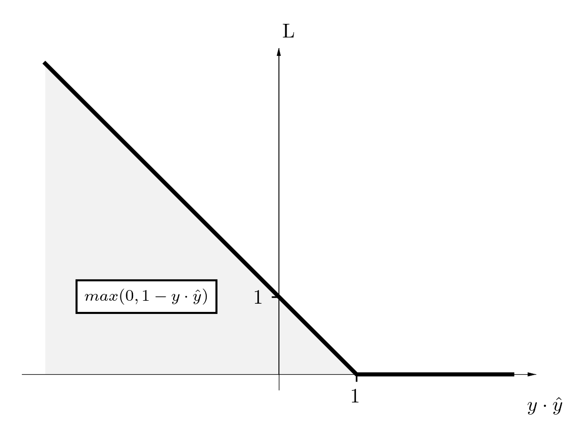
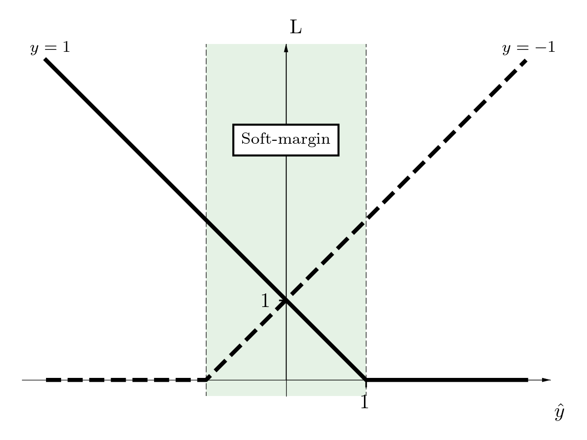 
</p>

For our experiment, we use a simple linear classifier, so the model has only a single vector  and bias . 
The landscape of loss in terms of  for non-linear models is highly irregular 
(left figure, code [here](plots/landscape_complex.py)), however now, 
it is just a straight line (right figure, code [here](plots/landscape_simple.py)).

<p align="middle">
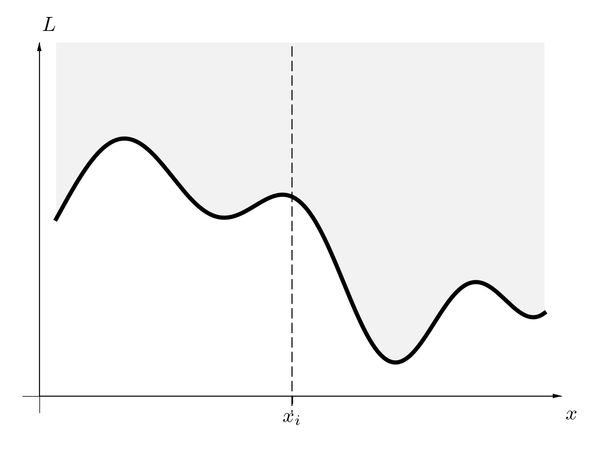
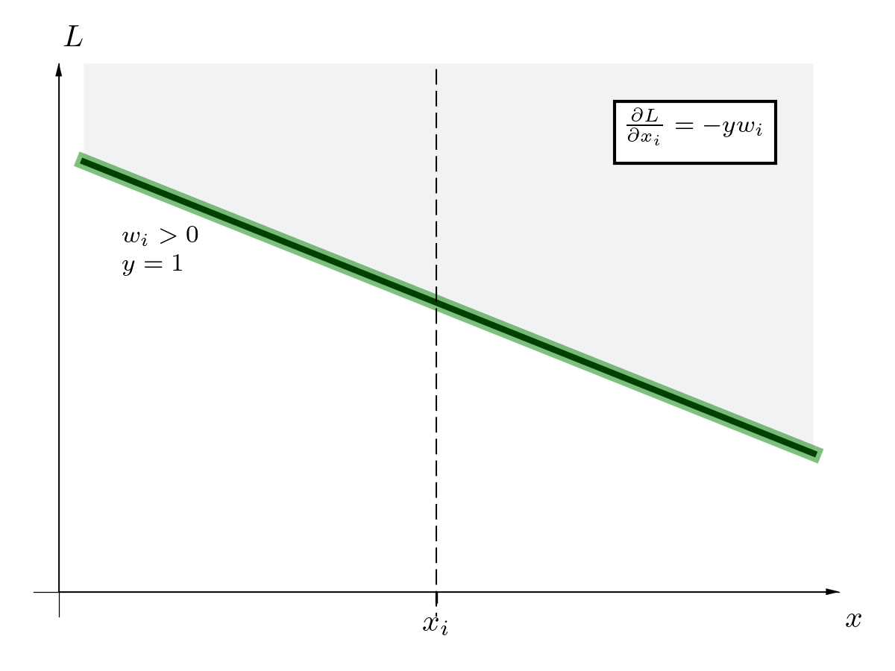 
</p>

Using a dataset and an optimization method gradient descent, we follow the gradient and look for model parameters, 
which minimize the loss function:

<p align="center"></p>

Super straightforward, right? 
It is our regular training. 
We minimize the expected value of the loss. 
Therefore the model is looking for any (even weak) correlation, which improves the performance on average 
(no matter how disastrous its predictions sometimes are). 

<p align="center"></p>

<br/>

### Towards Robust Binary Classification

As we mentioned in the introduction, ML models (deep neural networks in particular) are sensitive to little changes.
Therefore now, we allow perturbing the input a little bit.
We are not interested in patterns which concern  exclusively but the entire subspace around . 
In consequence, we face the min-max problem, and related two challenges.

<p align="center"></p>

<br/>

Firstly, how to construct valid perturbations ?
We want to formulate the subspace around  (figure below, code [here](plots/perturbation_boxes.py)), 
which sustains human understanding about this subspace. 
In our case, if a point  describes a digit one, then we have to guarantee that each perturbation  
looks like a digit one. 
We do not know how to do it formally. 
However, we can (sure enough) assume that little norm perturbations are correct 
. 
In our experiments, we use the infinity norm  (others are common too). 
These tiny boxes are neat, because valid perturbations are in a range  to , 
independently of dimension.

<p align="middle">
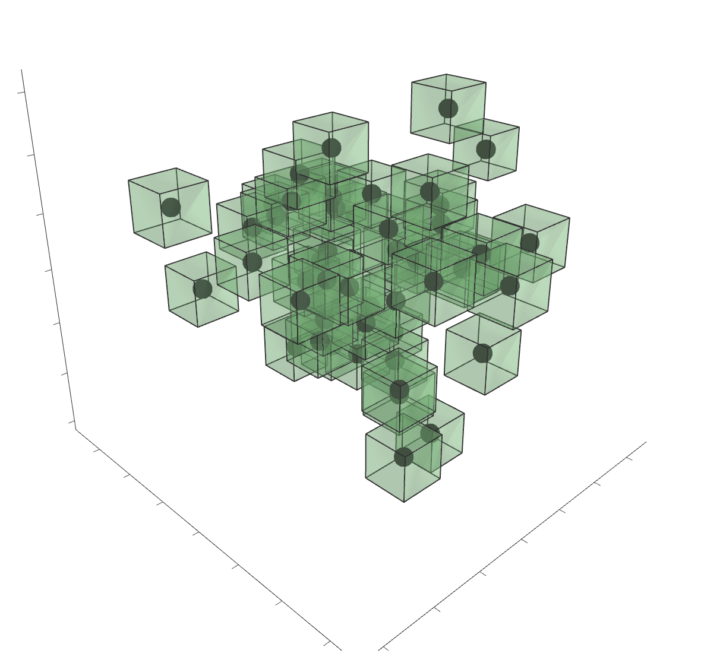
</p>

<br/>

The second challenge is how to solve the inner maximization problem.
The ML models are highly non-linear, so it is tough in general. 
There are several methods to approximate the solution (a lower or upper bound), 
which we cover in the upcoming blog posts. 
Hopefully, in the linear case, we can easily solve it exactly 
because the loss directly depends on , our simplified loss landscape 
(formal details [here](https://adversarial-ml-tutorial.org/linear_models/)). 

<p align="center"></p>

<br/>

The basic intuition is that we do not penalize high weights, 
which are far from the decision boundary (in contrast to regularization ).
However, it is far from a complete explanation. 

Firstly, the loss does not penalize if a classifier makes a mistake, 
which is close to the decision boundary (left figure, code [here](plots/hinge_robust.py)).
The error tolerance is dynamically changing regards to model weights, shifting the loss curve. 
In opposite to regular training, we do not force to preserve the strict defined margin, 
which sometimes can not be achieved.

<p align="middle">
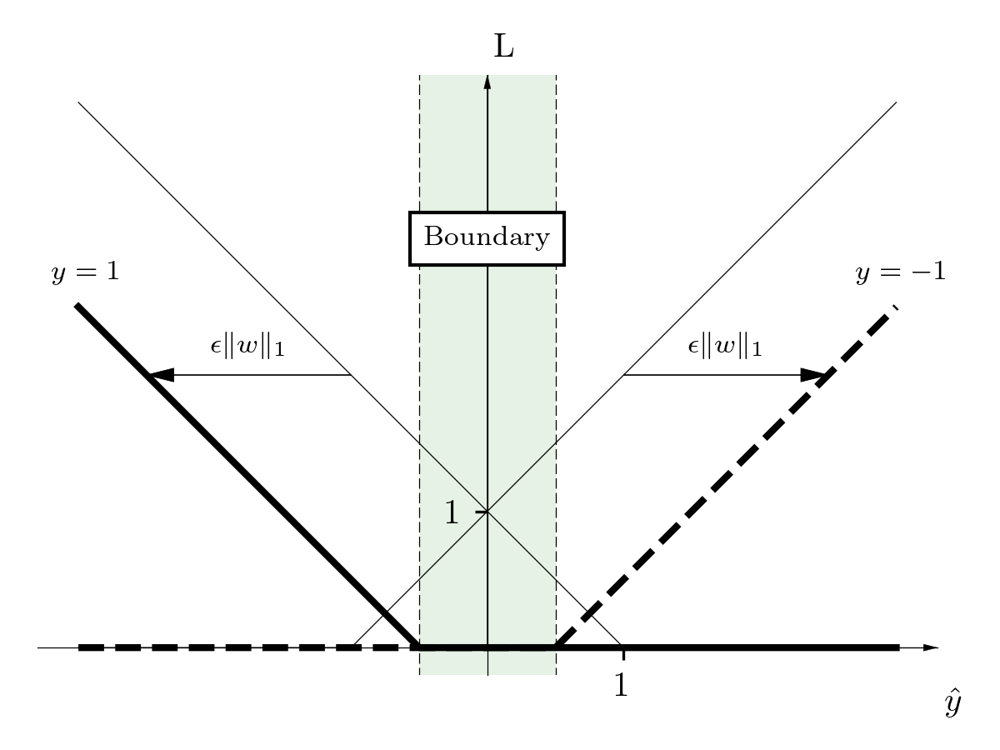
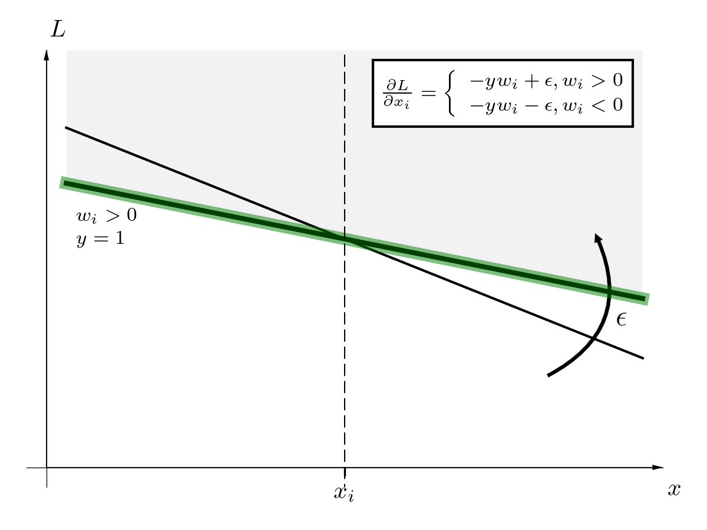 
</p>

Secondly, the backpropagation is different (right figure, code [here](plots/landscape_robust.py)). 
The gradient is not only diminished, but also if it is smaller than epsilon, it can even change a sign. 
As a result, the weights which are smaller than epsilon are gently wiped off. 

Finally, our goal is to minimize the expected value of the loss not only of input , 
but the entire subspace around :

<p align="center"></p>

<br/>

### Experiments

As we mentioned, today, we do a simple binary classification. 
Let's briefly present regular training (code [here](experiment_regular.py)). 
We reduce the MNIST dataset to include exclusively digits zero and one (transforming the original dataset here). 
We build a regular linear classifier, SGD optimizer, and hinge loss. 
We work with the high-level Keras under Tensorflow 2.0 with eager execution (PyTorch alike). 

```python
# Convert Multi-class problem to binary
train_dataset = data.binary_mnist(split='train').batch(100)     # In fact, we should do three folded split
test_dataset = data.binary_mnist(split='test').batch(1000)      # to make a valid test.

# Build and compile linear model
model = keras.Sequential([
    keras.layers.Flatten(input_shape=(28, 28, 1)),
    keras.layers.Dense(1),
])
sgd_optimizer = keras.optimizers.SGD(learning_rate=.1)
hinge_loss = keras.losses.Hinge()  # This is: max(0, 1 - y_true * y_pred), where y_true in {+1, -1}
```

<br/>

In contrast to just invoking the built-in `fit` method, we build the custom routine 
to have full access to any variable or gradient. 
We abstract the `train_step`, which processes a single batch. 
We build several callbacks to collect partial results for further analysis.

```python
def train_step(inputs, targets):        # Inject dependencies: a model, loss, and an optimizer
    with tf.GradientTape() as tape:
        prediction = model(inputs)
        loss_value = hinge_loss(prediction, targets)
    gradients = tape.gradient(loss_value, model.trainable_variables)
    sgd_optimizer.apply_gradients(zip(gradients, model.trainable_variables))
    predicted_labels = tf.sign(prediction)
    return predicted_labels, loss_value, gradients
```

<br/>

The robust training is similar. 
The crucial change is the customized loss, which contains additionally  term. 
More details are [here](experiment_robust.py).

```python
def robust_hinge_loss(model, y_hat, y):     # Inject the epsilon
    w, b = model.trainable_variables
    hinge = lambda x: tf.maximum(0, 1-x)    # The raw hinge function
    delta = -epsilon * tf.norm(w, ord=1)    # Use the inf ball
    z1 = y * tf.reshape(y_hat, [-1])
    z2 = tf.add(z1, delta)
    loss_value = hinge(z2)
    return loss_value
```

<br/>

### Results

We do a binary classification to recognize digits zero and one from the MNIST dataset. 
We trained regular and robust models using presented scripts ([1](experiment_regular.py), [2](experiment_robust.py)). 
Our regular model achieves super results (robust models are slightly worst). 

<p align="middle">
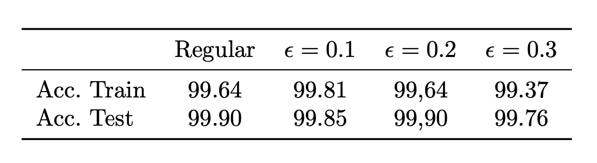
</p>

<br/>

We have only single mistakes (figure below, code [here](plots/misclassified_regular.py)). 
A dot around digit makes general confusion. 
Nevertheless, we have incredibly precise classifiers. 
We achieve human performance in recognizing handwritten digits zero and one, isn’t it? 

<p align="middle">
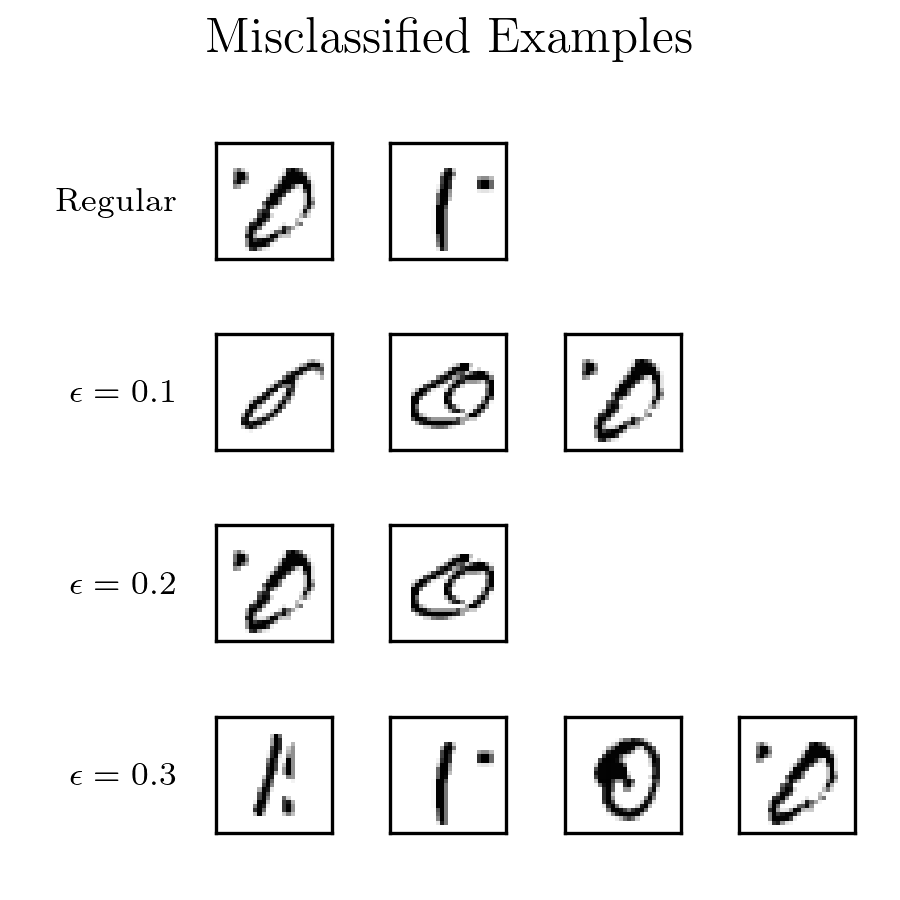
</p>

<br/>

Not really. 
We can precisely predict (without overfitting, 
take a look at the tiny gap between the train and test results), that is. 
We are absolutely far from human reasoning about digits zero and one. 
To demonstrate this, we check model weights (figure below, code [here](plots/model_weights.py)). 
Our classifiers are linear therefore the reasoning is straightforward. 
You can imagine the kind of a single stamp. 
The decision moves toward a digit one if black pixels are activated (and to a digit zero if white). 
The regular model contains huge amount of weak features, which do not make sense for us, but well generalize. 
In contrast, robust models  wiped off weak features (which are smaller than epsilon), 
and stick with more robust and human aligned features.

<p align="middle">
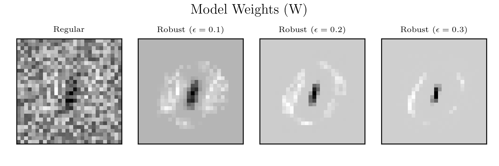
</p>

<br/>

Now, we do several white-box adversarial attacks and try to fool our models. 
We evaluate models on perturbed test datasets, wherein each sample is moved directly towards decision boundary. 
In our linear case, the perturbations can be easily defined as:

<p align="center"></p>

where we check out several epsilons (figure below, code [here](plots/accuracy_noise.py)).

<p align="middle">
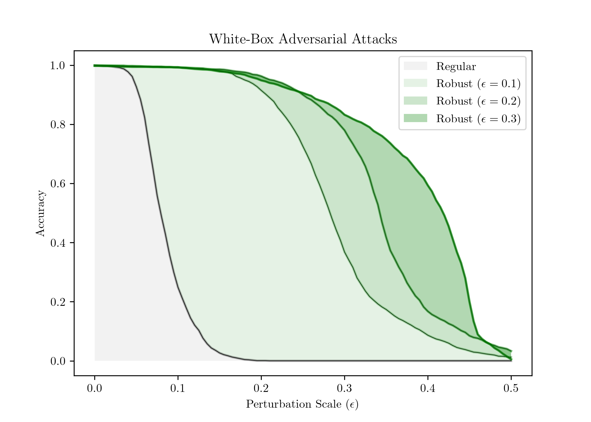
</p>

<br/>

As we expect, the regular model is brittle due to the huge amount of weak features. 
Below we present misclassified samples which are closest to the boundary decision 
(predicted logits are around zero, figure code [here](plots/misclassified_noise.py)). 
Now, we understand how readable for humans are perturbed images e.g.  
where the regular classifier has the accuracy around zero. 
The regular classifier absolutely does not know how a digit zero or one looks like. 
Robust models are generally confused about different digit geometry, but still, they are far from ideal.

<p align="middle">
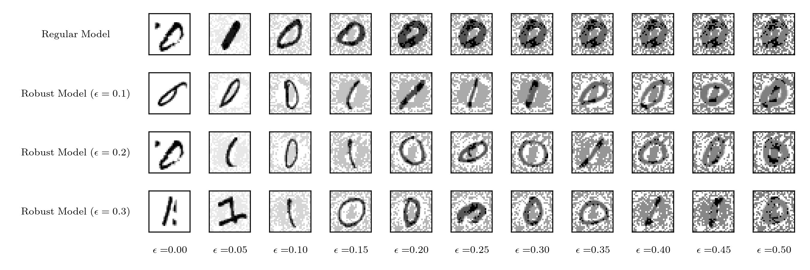
</p>

<br/>

In the end, we present a slightly different perspective.
Take a look at logit distributions of misclassified samples. 
We see that the regular model is extremely confident about wrong predictions. 
In contrast, the robust model (even if it is fooled) is uncertain, because logits tend to be close to zero. 
Robust models seem to be more reliable (figure code [here](plots/misclassified_logits.png)). 

<p align="middle">
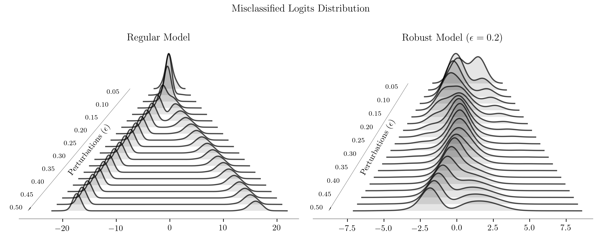
</p>

<br/>

### Conclusions

Machine Learning models are great and powerful. 
However, the characteristic of regular training lead to severe consequences in the security and safety 
of deep neural networks in particular. 
In this blog post, we show how robust training can look like. 
This is only a simple binary case, which (we hope) gives more intuition about the drawbacks of regular training, 
and shows why these problems are so vital. 
Of course, things are more complex if we want to force deep neural networks to be more robust 
because performance rapidly declines, and models become useless. 
Nonetheless, the ML community works hard to popularize and develop the idea of the robust ML, 
as this blog post tries to do.

<br/>

In the next blog posts, we present how to achieve more robust deep neural networks, 
and how they can be super meaningful.

<br/>

### References

**Must read articles** are listed in [Adversarial Machine Learning Reading List](https://nicholas.carlini.com/writing/2018/adversarial-machine-learning-reading-list.html) (Nicholas Carlini)

<br/>

**Tutorials**:
- CS231n: [Adversarial Examples and Adversarial Training - Stanford](https://www.youtube.com/watch?v=CIfsB_EYsVI), Ian Goodfellow
- [Adversarial Robustness, Theory and Practice](https://adversarial-ml-tutorial.org), MIT and [video](https://youtube.videoken.com/embed/fQyT5wkFxGI)
- Adversarial Machine Learning - [Part 1](https://www.youtube.com/watch?v=xLy6FGvS6iI) and [Part 2](https://www.youtube.com/watch?v=8_GrIwfkKrE) Biggio Battista

<br/>

**Blog posts**:
- [A Brief Introduction to Adversarial Examples](https://gradientscience.org/intro_adversarial/), Gradient Science Group MIT - Jul 2018
- Training Robust Classifiers - [Part 1](https://gradientscience.org/robust_opt_pt1/) and [Part 2](https://gradientscience.org/robust_opt_pt2/), Gradient Science Group MIT - Aug 2018 
- [Breaking things is easy](http://www.cleverhans.io/security/privacy/ml/2016/12/16/breaking-things-is-easy.html), Ian Goodfellow and Nicolas Papernot - Dec 2016
- [Is attacking machine learning easier than defending it?](http://www.cleverhans.io/security/privacy/ml/2017/02/15/why-attacking-machine-learning-is-easier-than-defending-it.html) Ian Goodfellow and Nicolas Papernot - Feb 2017
- [How to know when machine learning does not know](http://www.cleverhans.io/security/2019/05/20/dknn.html), Nicolas Papernot and Nicholas Frosst - May 2019
- [Why Machine Learning is vulnerable to adversarial attacks and how to fix it](https://www.kdnuggets.com/2019/06/machine-learning-adversarial-attacks.html), KDnuggets - Jun 2019
- [Breaking neural networks with adversarial attacks](https://www.kdnuggets.com/2019/03/breaking-neural-networks-adversarial-attacks.html), KDnuggets - Mar 2019
- [Adversarial Patch on Hat Fools SOTA Facial Recognition](https://medium.com/syncedreview/adversarial-patch-on-hat-fools-sota-facial-recognition-82e8c4f83498), Medium - Aug 2019
- [Why deep-learning AIs are so easy to fool?](https://www.nature.com/articles/d41586-019-03013-5) Nature - Oct 2019
- [“Brittle, Greedy, Opaque, and Shallow”: The Promise and Limits of Today’s Artificial Intelligence - A Conversation with Rodney Brooks and Gary Marcus (MIT)](https://www.flagshippioneering.com/stories/brittle-greedy-opaque-and-shallow-the-promise-and-limits-of-todays-artificial-intelligence) - Sep 2019
- [Identifying and eliminating bugs in learned predictive models](https://deepmind.com/blog/article/robust-and-verified-ai), DeepMind- Mar 2019
- [Better Language Models and Their Implications](https://openai.com/blog/better-language-models/), OpenAI - Feb 2019

<br/>

**Tools**:
- [MadryLab/robustness](https://github.com/MadryLab/robustness) - library for experimenting with adversarial robustness
- [CleverHans](https://github.com/tensorflow/cleverhans) - library to benchmark machine learning systems' vulnerability to adversarial examples 
- [Adversarial Robustness 360 Toolbox](https://github.com/IBM/adversarial-robustness-toolbox), IBM

<br/>

**Groups**
- [Robust ML](https://www.robust-ml.org) (Maintainers MIT)
- [Trusted AI Group IBM](http://research.ibm.com/artificial-intelligence/trusted-ai/)
- [SafeAI ETH Zurich](http://safeai.ethz.ch/)
